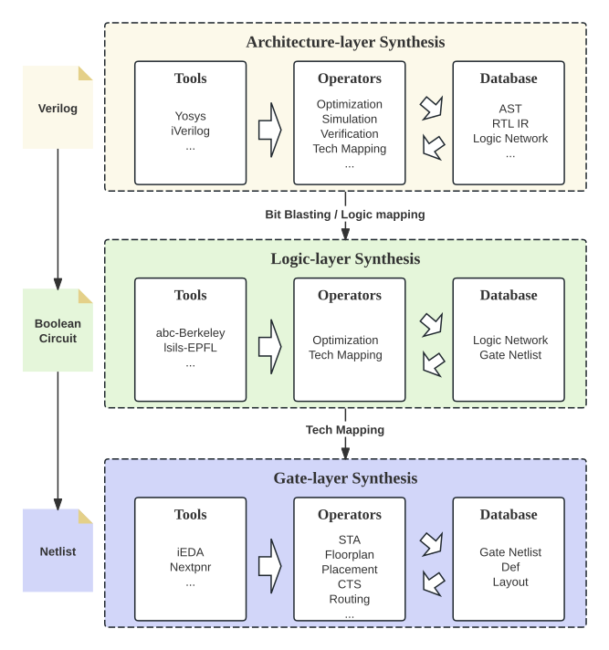
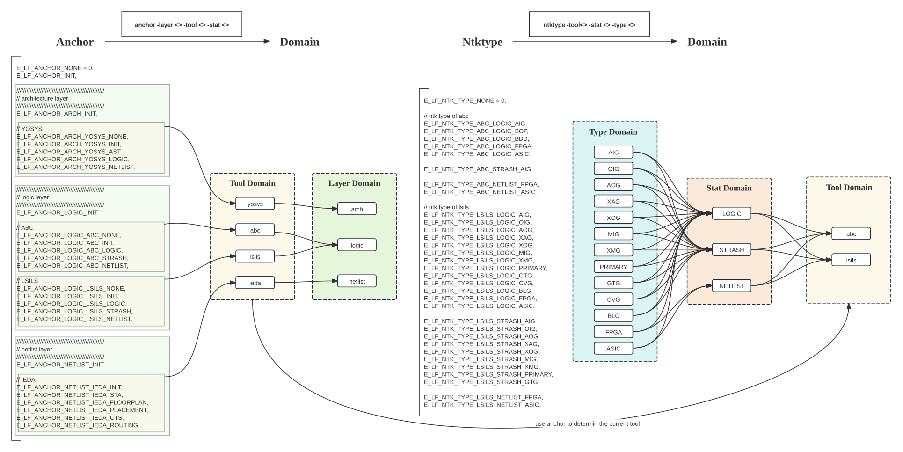
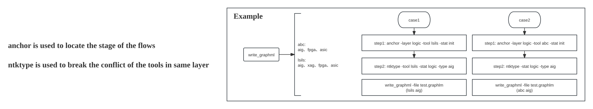

# LogicFactory

LogicFactory is an open-source logic synthesis platform for integrated cross-tool flow.

<div style="text-align: center;">
    
</div>

# Build
- method1: build with docker env (recommend)
```
$ git clone https://github.com/Logic-Factory/LogicFactory.git
$ cd LogicFactory
$ git submodule update --init --recursive
$ docker build -t logic-factory:latest .
$ docker run -it -v ./LogicFactory:/workspace logic-factory:latest
$ cd /workspace
$ mkdir -p build && cd build
$ cmake -G Ninja ..
$ ninja

# 1. 克隆代码库
git clone https://github.com/Logic-Factory/LogicFactory.git

# 2. 进入目录并初始化子模块
cd LogicFactory
git submodule update --init --recursive

# 3. 构建 Docker 镜像（无需修改）
docker build -t logic-factory:latest .

# 4. 运行容器（关键：添加 --gpus all 启用 GPU 访问）
docker run -it --gpus all -v ../LogicFactory-hub-pku:/workspace logic-factory:latest
#  ↑↑↑ 新增 --gpus all 选项，允许容器访问主机所有 GPU

# 5. 进入容器后，正常构建（无需修改）
cd /workspace
mkdir -p build && cd build
cmake -G Ninja ..
ninja
```

- method2: install dependencies and compile 
    - install build essential
    ```
    $ sudo apt-get update && sudo apt-get upgrade -y --no-install-recommends apt-utils
    $ sudo apt-get install -y software-properties-common build-essential wget curl cmake ninja-build git
    $ sudo apt-get install -y libreadline6-dev tcl-dev pkg-config bison flex rustc cargo libboost-all-dev libeigen3-dev libgtest-dev libgoogle-glog-dev libyaml-cpp-dev libcairo2-dev libunwind-dev libgmp-dev libgmpxx4ldbl libhwloc-dev libffi-dev libgflags-dev libmetis-dev
    ```
    - install gcc-10/g++-10
    ```
    $ sudo add-apt-repository ppa:ubuntu-toolchain-r/test -y
    $ sudo apt-get update
    $ sudo apt-get install -y gcc-10 g++-10
    $ sudo update-alternatives --install /usr/bin/gcc gcc /usr/bin/gcc-10 60 --slave /usr/bin/g++ g++ /usr/bin/g++-10
    ```
    - install rust
    ```
    $ export RUSTUP_DIST_SERVER=https://mirrors.tuna.tsinghua.edu.cn/rustup
    $ curl --proto '=https' --tlsv1.2 -sSf https://sh.rustup.rs | sh -s -- -y
    $ export PATH="/root/.cargo/bin:${PATH}"
    ```
    - compile
    ```
    $ git clone https://github.com/Logic-Factory/LogicFactory.git
    $ cd LogicFactory
    $ git submodule update --init --recursive
    $ mkdir -p build && cd build
    $ cmake -G Ninja ..
    $ ninja
    ```


# Getting Started
- RUN with tcl \
  before run this, you need to modify the datapath in the "demo/test.tcl" and  "config/layer_netlist/ieda/config_sky130.json".
```
$ ./build/app/logicfactory -s "demo/test.tcl"
```

- RUN with command sequence
```
$ ./build/app/logicfactory -c "help; start;"
```

- RUN with command line
```
$ ./build/app/logicfactory
--------------------------------------------
*    Welcome to LogicFactory (Platform)    *
*               Version 0.1                *
*     https://github.com/Logic-Factory     *
--------------------------------------------
% help
```

# Scheme
Anchor-based tool and logic type location
<div style="text-align: center;">
    
    
</div>

# Acknowledgement
- [yosys](https://github.com/YosysHQ/yosys)
- [berkeley-abc](https://github.com/berkeley-abc/abc)
- [epfl-lsils](https://github.com/lsils/lstools-showcase)
- [iEDA](https://github.com/OSCC-Project/iEDA)

# Q&A
- slack \
    [https://join.slack.com/t/open-logic-factory/shared_invite/zt-2sjpzqk1y-1SM9Xcx8CNTULq72l80H~w](https://join.slack.com/t/open-logic-factory/shared_invite/zt-2sjpzqk1y-1SM9Xcx8CNTULq72l80H~w)

# Contact
- email \
    Liwei Ni: nlwmode at gmail dot com